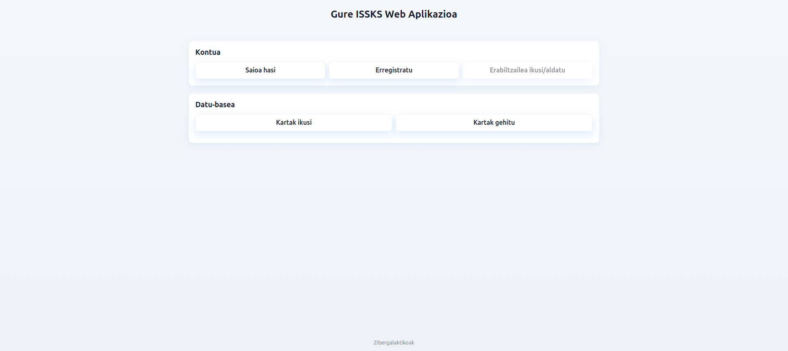

# ISSKS Proiektua
> Proiektu honetan datu base bat eta horri konektatuko den web aplikazio bat sortu dugu.

## Aurkibidea
* [Partaideak](#partaideak)
* [Informazio orokorra](#informazio-orokorra)
* [Erabilitako teknologia](#erabilitako-teknologia)
* [Ezaugarriak](#ezaugarriak)
* [Pantaila-argazkiak](#pantaila-argazkiak)
* [Konfigurazioa](#konfigurazioa)
* [Erabilera](#erabilera)
* [Proiektuaren egoera](#proiektuaren-egoera)
<!--* [Hobekuntza posibleak](#hobekuntza-posibleak)
* [Esker onak](#esker-onak)-->

## Partaideak

- Urko Bidaurre
- Ander Ibarra
- Yassin Mehani
- Eneko Puente
- Unai Rodríguez
- Asier Sinobas

## Informazio orokorra
- Proiektu honetan datu base bat eta horri konektatuko den web aplikazio bat sortu dugu.

## Erabilitako teknologia
- mariadb - 10.8.2
- phpmyadmin - azkenengo bertsioa
- php - 7.2.2-apache


## Ezaugarriak
Hona hemen gure aplikazioaren ezaugarri nagusiak:
- Erabiltzaileen indentifikazio
- Erabiltzaileen erregistroa
- Erabiltzailearen datuak aldatzea
- Datuak gordetzea
- Datuak ezabatzea
- Datuak aldatzea


## Pantaila-argazkiak

<!-- If you have screenshots you'd like to share, include them here. -->


## Konfigurazioa
Web Sistema honek, **Docker 28.4.0**, **Docker Compose 2.39.2** eta **Ubuntu 24.04.2 LTS** dituen sistema eragile batean behar bezala zuzen funtzionatzeko diseinatuta dago, beraz gomendagarria da instalatuta eukitzea.

## Erabilera
- Sistema hau zure ordenagailuan behar den moduan funtzionarazteko, lehenik eta behin _**web**_ irudia eraiki behar duzu:
  ```bash
    docker build -t="web" .
  ```
- Gero, sistemaren kontainerrak martxan jarri:
  ```bash
    docker-compose up -d
  ```
- Ondoren, datu-basea inportatu, horretarako:
  - [phpMyAdmin](http://localhost:8890/) web orrialdera sartu.
  - _**admin**_ erabiltzailea eta _**test**_ pasahitza erabili saioa hasteko.
  - **Importar** botoiari eman, ondoren **Examinar** eta azkenik proiektuaren direktorioan dagoen **database.sql** fitxategia hautatu.
- Azkenik, [Web Orrialde](http://localhost:81/) -ra nabigatu eta sistema erabili.


## Proiektuaren egoera
Proiektua _garapenean_ dago. Oraindik ez dago amaituta

<!--
## Hobekuntza posibleak
Include areas you believe need improvement / could be improved. Also add TODOs for future development.

Room for improvement:
- Improvement to be done 1
- Improvement to be done 2

To do:
- Feature to be added 1
- Feature to be added 2


## Esker onak
Give credit here.
- This project was inspired by...
- This project was based on [this tutorial](https://www.example.com).
- Many thanks to...
-->
